# :bulb: Remember Mini Man
[![License][licensesvg]][LICENSE.md] <br />
[README of Korean][README_ko.md] <br />
This is a simple board game using memory. <br />

<a href='https://play.google.com/store/apps/details?id=me.blog.korn123.rememberminiman'></a><br />

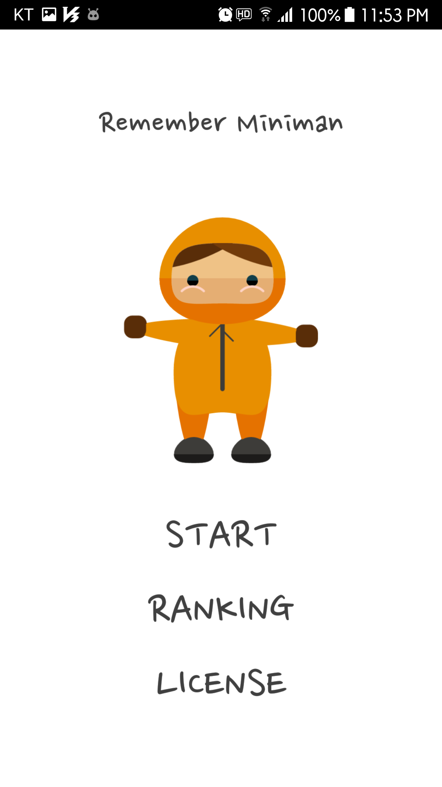

# How to play
```
Step1. Remember Miniman in order.
       stage1: 3 Miniman
       stage2: 5 Miniman
       stage3: 8 Miniman
```
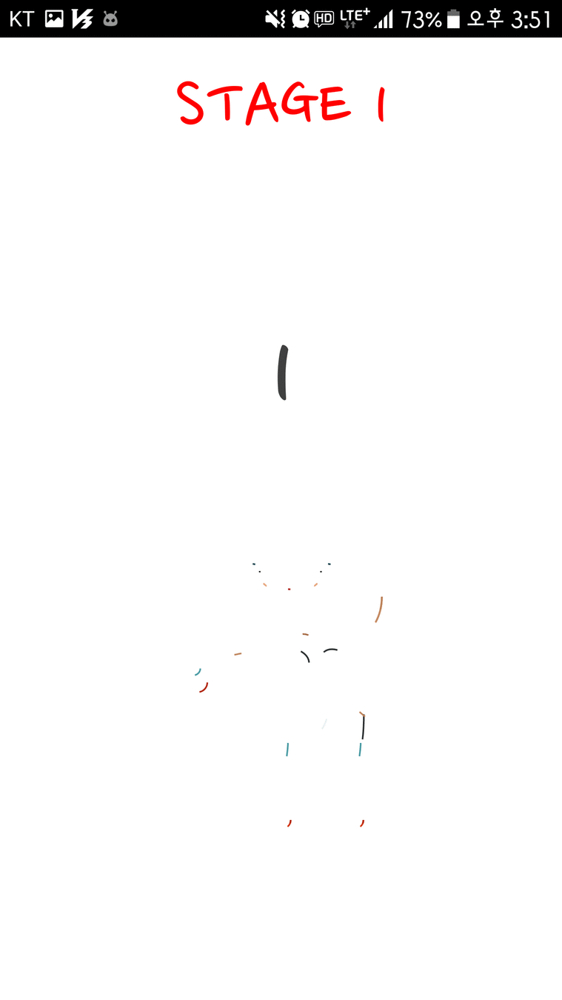&nbsp;
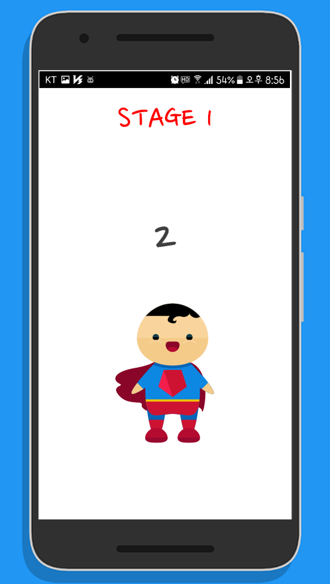&nbsp;
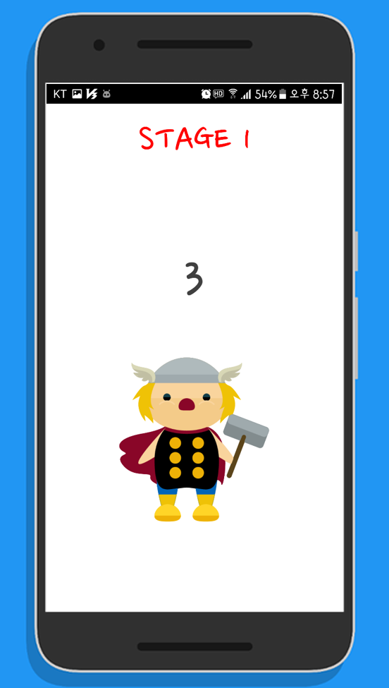

```
Step2. Choose Miniman in order.
```
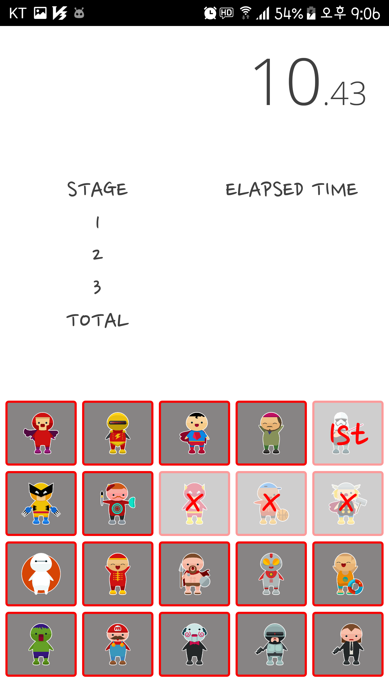&nbsp;
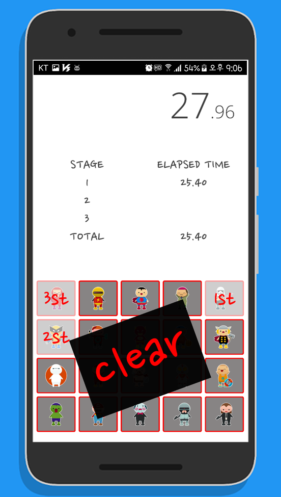

```
Step3. Repeat to stage three.
       The final record is the sum of the elapsed times of all stages.
       I will use the firebase database to provide the ranking later.
```
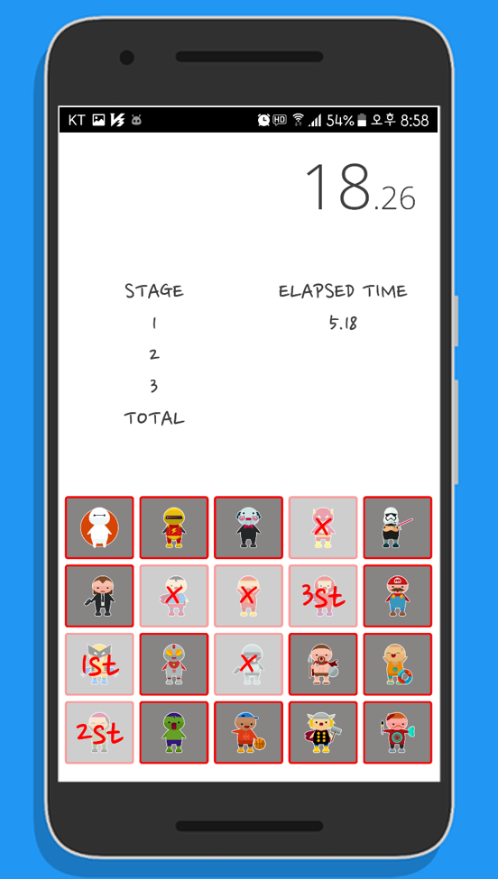&nbsp;
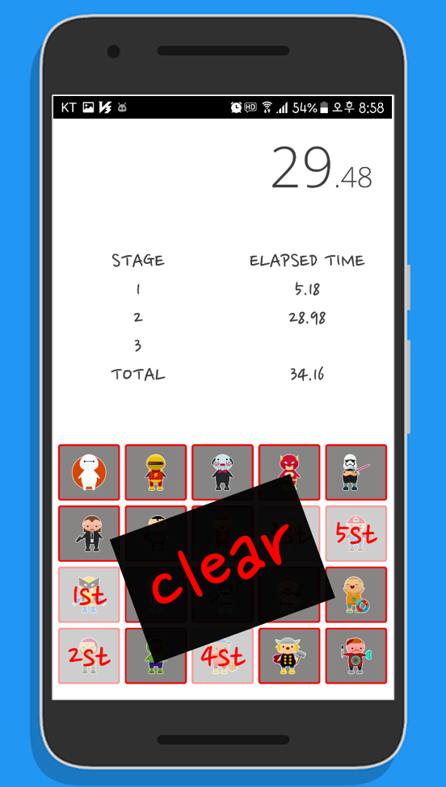&nbsp;
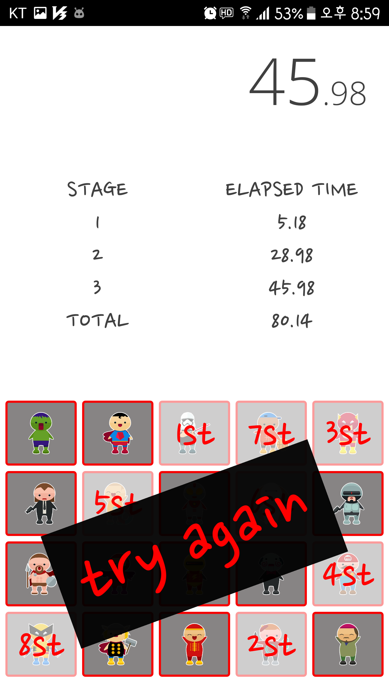&nbsp;

```
Step4. Create an account for ranking. (Firebase Database)
       The ID must be an email account that you use.
       Password must be at least 6 characters long.
```
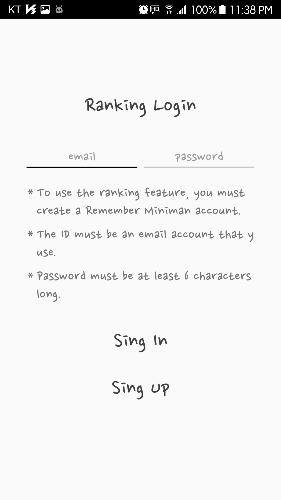&nbsp;
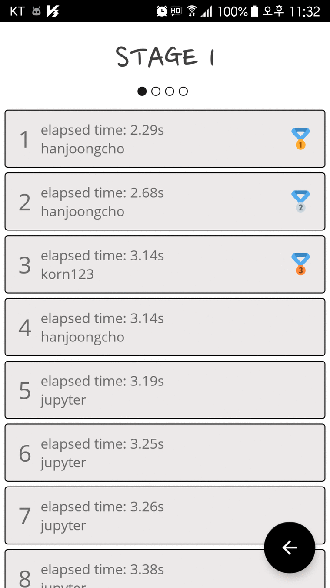&nbsp;

# How to build
```
Step1. Fork or download 'remember-miniman' project.
Step2. Import 'remember-miniman' project into android studio.
Step3. Use below link download svg images from Flaticon.
Step4. Choose 20 svg images of your liking and change the file name as below.
       ex> miniman_1.svg, miniman_2.svg, ..., miniman_19.svg, miniman_20.svg
Step5. Copy the 20 renamed files to the '/app/src/main/res/raw' directory.
Step6. Create a project from the Firebase console(https://firebase.google.com/).
Step7. Download the 'google-services.json' file from the Firebase console and copy it to the '/remember-miniman/app/' directory.
Step8. Build 'remember-miniman' project with android studio.
```
[Download miniman svg images from Flaticon][1]

# License
[LICENSE][LICENSE.md]


[1]: https://www.flaticon.com/packs/miniman
[licensesvg]: https://img.shields.io/badge/License-Apache--2.0-brightgreen.svg
[README_ko.md]: https://github.com/hanjoongcho/remember-miniman/blob/master/README_ko.md
[LICENSE.md]: https://github.com/hanjoongcho/remember-miniman/blob/master/LICENSE.md